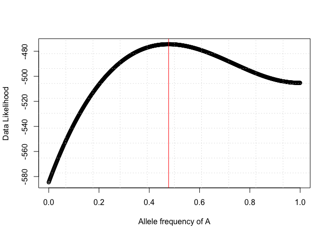
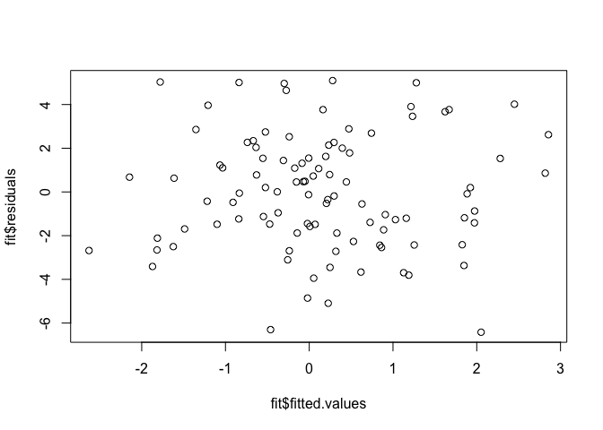
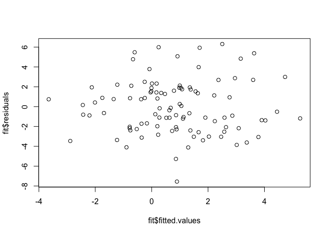
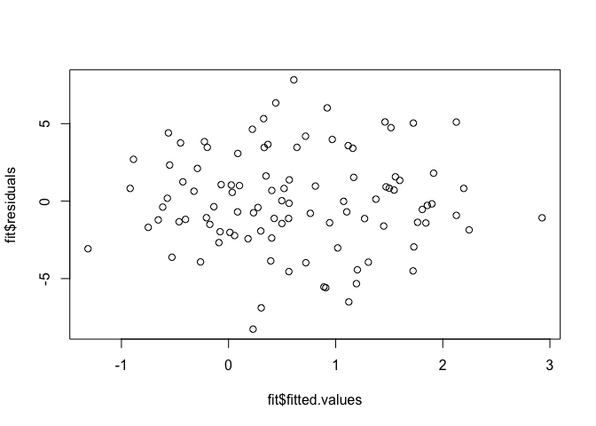
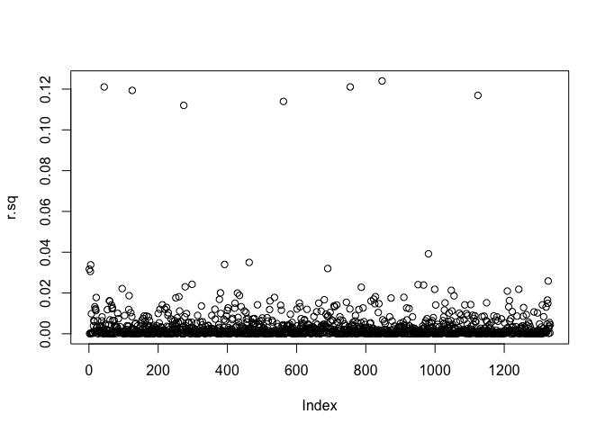
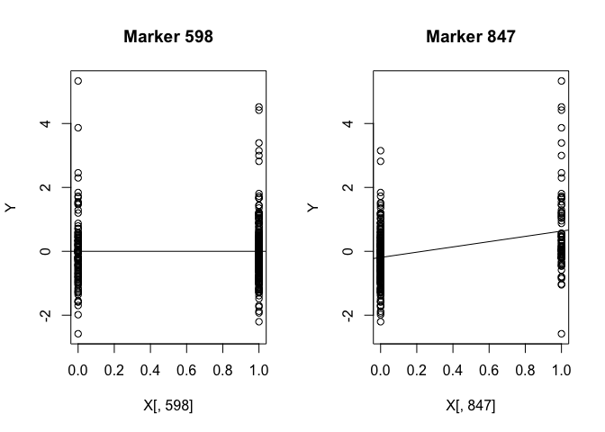
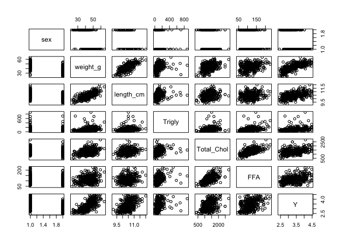
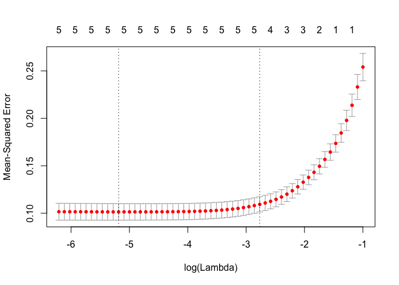

Parameter Estimation and Machine Learning
================
Yue Shi, Ph.D candidate, University of Washington
5/8/2018

-   [Maximum Likelihood Estimation (MLE)](#maximum-likelihood-estimation-mle)
    -   [Example: Halitosis example](#example-halitosis-example)
    -   [Example: Model selection based on maximum likelihood](#example-model-selection-based-on-maximum-likelihood)
-   [Maximum a Posteriori Estimation (MAP)](#maximum-a-posteriori-estimation-map)
    -   [beta distribution](#beta-distribution)
    -   [Example:Thumbtack example (unfair coin)](#examplethumbtack-example-unfair-coin)
-   [Ordinary Linear Regression](#ordinary-linear-regression)
    -   [Example: Simulation data](#example-simulation-data)
    -   [Example: Quantitative trait loci analysis for cholesterol levels](#example-quantitative-trait-loci-analysis-for-cholesterol-levels)
-   [Model selection and cross validation](#model-selection-and-cross-validation)
    -   [Ridge regression or L2 regularized linear regression](#ridge-regression-or-l2-regularized-linear-regression)
    -   [LASSO regression or L1 regularized linear regression](#lasso-regression-or-l1-regularized-linear-regression)
    -   [LOOCV (leave one out cross validation)](#loocv-leave-one-out-cross-validation)
    -   [Example: Simulation data](#example-simulation-data-1)
    -   [Example: Insulin](#example-insulin)
    -   [Example: Quantitative trait loci analysis for cholesterol levels](#example-quantitative-trait-loci-analysis-for-cholesterol-levels-1)

Maximum Likelihood Estimation (MLE)
-----------------------------------

Likelihood is:
*L*(*θ* : *D**a**t**a*)=*P*(*D**a**t**a*|*θ*)
 Maximum likelihood Estimation is to find *θ*<sup>\*</sup> to maximize the likelihood. This *θ*<sup>\*</sup> is the maximum likelihood estimate of *θ*.

#### Example: Halitosis example

Halitosis, colloquially called bad breath, is a symptom in which a noticeably unpleasant odor is present on the exhaled breath. Halitosis is partly genetically determined. The genotype aa has a 40% chance of getting the disease, and the other two possible genotypes, AA and Aa, each has a 10% chance of getting the disease. We want to estimate the frequency of the A allele.

If the gene frequency of the A allele is p, and that of a is 1-p, then the frequency of the disease is expected to be (if the genotypes are in Hardy-Weinberg proportions as a result of random mating):

*F* = *p*<sup>2</sup> × (0.1)+2*p*(1 − *p*)×(0.1)+(1 − *p*)<sup>2</sup> × (0.4)

Now suppose we observe 1000 individuals and find that the 182 of them have the disease. Using a binomial distribution, the probability that 182 out of 1000 have the disease is the binomial class probability for 182 out of 1000 when the probability of the event is F (which is a function of p). This is

$$\\frac{1000!}{182!~818!} F^{182} (1-F)^{818}$$

``` r
##Given p, calcualte the probability of getting Halitosis
H=function(x){
  hal=0.1*x^2 + 0.1*2*x*(1-x) + 0.4*(1-x)^2 
  return(hal)
}

##Given H, calcualte the log likelihood of getting the data. 
LD=function(x){
  LL=182*log(x)+818*log(1-x)
  return(LL)
}

##Now let's find p which maximize the LD. 
fp=seq(0,1,0.001)
fLD=LD(H(fp))
mle=fp[which.max(fLD)]
mle
```

    ## [1] 0.477

``` r
plot(fLD~fp, xlab="Allele frequency of A", ylab="Data Likelihood")
grid(10,10)
abline(v=mle,col="red")
```



#### Example: Model selection based on maximum likelihood

we will implement an algorithm for selecting among various structures of the regulatory network. Specifically, we will focus on two possible models of the galactose regulatory network in S. cerevisiae. We will select a model based on the expression data on these three genes measured across S. cerevisiae individuals.

Likelihood function of Model 1:
*L*(*D*|*θ*)=*P*(*G**a**l*80)*P*(*G**a**l*4|*G**a**l*80)*P*(*G**a**l*2|*G**a**l*4)
 Likelihood function of Model 2:
*L*(*D*|*θ*)=*P*(*G**a**l*4)*P*(*G**a**l*80)*P*(*G**a**l*2|*G**a**l*4, *G**a**l*80)
 Import the data

``` r
a <- read.table(header = T, file="https://sites.google.com/a/cs.washington.edu/genome560-spr18/disc-gal80-gal4-gal2.txt") 
names=a[,1]
a=a[,-1]
rownames(a)=names
dim(a) ## 3 genes, 112 samples
```

    ## [1]   3 112

``` r
a=t(a)
```

Remember: MLE solution is the same as the sample mean. We can calculate each component of the likelihood function from the data, and compare the log likelihood for Model 1 and Model 2.

Calculate *P*(*G**a**l*80) (the probablity of Gal 80 has high expression level) and *P*(*G**a**l*4) (the probablity of Gal 4 has high expression level).

``` r
p.80=sum(a[,1])/nrow(a)
p.4=sum(a[,2])/nrow(a)
```

Calculate *P*(*G**a**l*4|*G**a**l*80), *P*(*G**a**l*2|*G**a**l*4) and *P*(*G**a**l*2|*G**a**l*4, *G**a**l*80)

``` r
p.4H80H=sum(a[,1]==1 & a[,2]==1)/sum(a[,1])
p.4L80H=sum(a[,1]==1 & a[,2]==0)/sum(a[,1])
p.4H80L=sum(a[,1]==0 & a[,2]==1)/(nrow(a)-sum(a[,1]))
p.4L80L=sum(a[,1]==0 & a[,2]==0)/(nrow(a)-sum(a[,1]))


p.2H4H=sum(a[,2]==1 & a[,3]==1)/sum(a[,2])
p.2L4H=sum(a[,2]==1 & a[,3]==0)/sum(a[,2])
p.2H4L=sum(a[,2]==0 & a[,3]==1)/(nrow(a)-sum(a[,2]))
p.2L4L=sum(a[,2]==0 & a[,3]==0)/(nrow(a)-sum(a[,2]))

p.2H80H4H=sum(a[,1]==1 & a[,2]==1 & a[,3]==1)/sum(a[,1]==1 & a[,2]==1)
p.2L80H4H=sum(a[,1]==1 & a[,2]==1 & a[,3]==0)/sum(a[,1]==1 & a[,2]==1)
p.2H80H4L=sum(a[,1]==1 & a[,2]==0 & a[,3]==1)/sum(a[,1]==1 & a[,2]==0)
p.2L80H4L=sum(a[,1]==1 & a[,2]==0 & a[,3]==0)/sum(a[,1]==1 & a[,2]==0)
p.2H80L4H=sum(a[,1]==0 & a[,2]==1 & a[,3]==1)/sum(a[,1]==0 & a[,2]==1)
p.2L80L4H=sum(a[,1]==0 & a[,2]==1 & a[,3]==0)/sum(a[,1]==0 & a[,2]==1)
p.2H80L4L=sum(a[,1]==0 & a[,2]==0 & a[,3]==1)/sum(a[,1]==0 & a[,2]==0)
p.2L80L4L=sum(a[,1]==0 & a[,2]==0 & a[,3]==0)/sum(a[,1]==0 & a[,2]==0)
```

``` r
LL.m1=sum(a[,1])*log(p.80)+
(nrow(a)-sum(a[,1]))*(1-log(p.80))+
sum(a[,1]==1 & a[,2]==1)*log(p.4H80H)+
sum(a[,1]==1 & a[,2]==0)*log(p.4L80H)+
sum(a[,1]==0 & a[,2]==1)*log(p.4H80L)+
sum(a[,1]==0 & a[,2]==0)*log(p.4L80L)+
sum(a[,2]==1 & a[,3]==1)*log(p.2H4H)+
sum(a[,2]==1 & a[,3]==0)*log(p.2L4H)+
sum(a[,2]==0 & a[,3]==1)*log(p.2H4L)+
sum(a[,2]==0 & a[,3]==0)*log(p.2L4L)

LL.m2=sum(a[,1])*log(p.80)+
(nrow(a)-sum(a[,1]))*(1-log(p.80))+
sum(a[,2])*log(p.4)+
(nrow(a)-sum(a[,2]))*(1-log(p.4))+
sum(a[,1]==1 & a[,2]==1 & a[,3]==1)*log(p.2H80H4H)+
sum(a[,1]==1 & a[,2]==1 & a[,3]==0)*log(p.2L80H4H)+
sum(a[,1]==1 & a[,2]==0 & a[,3]==1)*log(p.2H80H4L)+
sum(a[,1]==1 & a[,2]==0 & a[,3]==0)*log(p.2L80H4L)+
sum(a[,1]==0 & a[,2]==1 & a[,3]==1)*log(p.2H80L4H)+
sum(a[,1]==0 & a[,2]==1 & a[,3]==0)*log(p.2L80L4H)+
sum(a[,1]==0 & a[,2]==0 & a[,3]==1)*log(p.2H80L4L)+
sum(a[,1]==0 & a[,2]==0 & a[,3]==0)*log(p.2L80L4L)

LL.m1
```

    ## [1] -80.05638

``` r
LL.m2
```

    ## [1] 44.27889

Since *L*(*M**o**d**e**l*2 : *D**a**t**a*) is greater than *L*(*M**o**d**e**l*1 : *D**a**t**a*), therefore Model 2 is favored over Model 1.

Maximum a Posteriori Estimation (MAP)
-------------------------------------

Posterior probability is:
$$
P(\\theta | D) = \\frac{P(D|\\theta)P(\\theta)}{P(D)} = \\frac{P(D|\\theta)P(\\theta)}{\\int P(D|\\theta)P(\\theta)d\\theta}
$$
 Since the demoninator is not a function of *θ*, therefore we can ignore the denominator， then
$$
\\begin{eqnarray}
P(\\theta | D) &\\propto& P(D|\\theta)P(\\theta)\\\\
Posterior &\\propto& Likelihood \* Prior
\\end{eqnarray}
$$
 MAP estimation is to find *θ* that maximizes posterior *P*(*θ*|*D*).
The difference between MLE and MAP is that:
For MLE: find *θ* that maximizes *l**o**g**P*(*D*|*θ*); whereas
For MAP: find *θ* that maximizes *l**o**g**P*(*D*|*θ*)+*l**o**g**P*(*θ*).

The difference between MAP and Bayesian estimation is that:
MAP ignore the demoninator which integrate all of the possible *θ*, which makes Bayesian method much more computational demanding. MAP is must faster and popular now.

#### beta distribution

**beta distribution**is parameterized by two shape constraints *α* and *β*. It does the job nicely for expressing the prior belief of probability which is restricted in the range \[0,1\].

$$
P(p)=\\frac{1}{B(\\alpha,\\beta)}p^{\\alpha-1}(1-p)^{\\beta-1}
$$
 where $B(,) is the beta function.

When both *α* and *β* are greater than zero, it has the following properties:
$$
mean=\\frac{a}{a+b}
$$

$$
mode=\\frac{\\alpha-1}{\\alpha+\\beta-2}
$$
$$
variance=\\frac{\\alpha\\beta}{(\\alpha+\\beta)^2(\\alpha+\\beta+1)}
$$

#### Example:Thumbtack example (unfair coin)

``` r
nh <- 100 #the number of heads
nt <- 50 #the number of tails
alpha <- 1000 #alpha and beta are hyperparameters
beta <- 1000
logLikelihood <- function(p, nh, nt){
  return(nh*log(p)+nt*log(1-p))
}

logPosterior <- function(p, nh, nt, alpha, beta){
  return((nh+alpha-1)*log(p)+(nt+beta-1)*log(1-p))
}
p=seq(0,1,0.01)
LL=logLikelihood(p,nh,nt)
LP=logPosterior(p,nh,nt,alpha,beta)
par(mfrow=c(1,2))
plot(LL~p, ylab="Likelihood",main="Likelihood")
plot(LP~p, ylab="Likelihood",main="Posterior (alpha=1000, beta=1000)")
```



``` r
LL.max=p[which.max(LL)]
LL.max
```

    ## [1] 0.67

``` r
nh/(nh+nt)
```

    ## [1] 0.6666667

``` r
LP.max=p[which.max(LP)]
LP.max
```

    ## [1] 0.51

``` r
(nh+alpha-1)/(nh+nt+alpha+beta-1)
```

    ## [1] 0.5114007

Let's minimize the influence of priors

``` r
alpha=30
beta=30
LL=logLikelihood(p,nh,nt)
LP=logPosterior(p,nh,nt,alpha,beta)
par(mfrow=c(1,2))
plot(LL~p, ylab="Likelihood",main="Likelihood")
plot(LP~p, ylab="Likelihood",main="Posterior (alpha=30, beta=30)")
```



``` r
LL.max=p[which.max(LL)]
LL.max
```

    ## [1] 0.67

``` r
nh/(nh+nt)
```

    ## [1] 0.6666667

``` r
LP.max=p[which.max(LP)]
LP.max
```

    ## [1] 0.62

``` r
(nh+alpha-1)/(nh+nt+alpha+beta-1)
```

    ## [1] 0.6172249

Ordinary Linear Regression
--------------------------

Linear regression is used to predict the value of an outcome variable (continuous) Y based on one or more variables X. The aim is to establish a linear relationship (a mathmatical formula) between the predictor variables and the response variable.
*Y* = *β*<sub>0</sub> + *β*<sub>1</sub>*X*<sub>1</sub> + *β*<sub>2</sub>*X*<sub>2</sub> + *ϵ*
 *ϵ* is the error term, the part of Y the regression model is unble to explain, and it follows *N*(0, *σ*<sup>2</sup>). The goal of linear regression is to find *β* to minimize the sum of squared errors (SSE).
$$
SSE=\\sum\_{i}^{n}(y\_i-\\hat{y\_i})^2
$$

$\\hat{y\_{i}}$ is the fitted value for observation i.
F-statistic is a measure of goodness of fit with associated p value for the model.

#### Example: Simulation data

``` r
X1=rnorm(100,mean=10, sd=5)
X2=rnorm(100,mean=-3, sd=4)
Y=1.1+0.02*X1+0.3*X2+rnorm(100,mean=0, sd=3)
```

Method 1: lsfit function in R

``` r
X=cbind(X1,X2)
rr=lsfit(X,Y)
ls.print(rr)
```

    ## Residual Standard Error=3.3336
    ## R-Square=0.0666
    ## F-statistic (df=2, 97)=3.4617
    ## p-value=0.0353
    ## 
    ##           Estimate Std.Err t-value Pr(>|t|)
    ## Intercept   0.9166  0.7917  1.1579   0.2498
    ## X1          0.0367  0.0637  0.5753   0.5664
    ## X2          0.2354  0.0952  2.4717   0.0152

``` r
## quadratic regression
X3=X1^2
Y2=1.1+0.02*X1+0.3*X3+rnorm(100,mean=0,sd=3)
X=cbind(X1,X3)
rr=lsfit(X,Y2)
ls.print(rr)
```

    ## Residual Standard Error=2.8559
    ## R-Square=0.9922
    ## F-statistic (df=2, 97)=6199.85
    ## p-value=0
    ## 
    ##           Estimate Std.Err t-value Pr(>|t|)
    ## Intercept  -0.9356  0.7413 -1.2621   0.2099
    ## X1          0.4262  0.1475  2.8890   0.0048
    ## X3          0.2815  0.0074 38.1632   0.0000

Method 2: lm function in R (you don't need to combine X1 and X2)

``` r
fit=lm(Y~X1+X2)
summary(fit)
```

    ## 
    ## Call:
    ## lm(formula = Y ~ X1 + X2)
    ## 
    ## Residuals:
    ##     Min      1Q  Median      3Q     Max 
    ## -7.3919 -2.3530 -0.1108  2.1422  9.8036 
    ## 
    ## Coefficients:
    ##             Estimate Std. Error t value Pr(>|t|)  
    ## (Intercept)  0.91663    0.79166   1.158   0.2498  
    ## X1           0.03667    0.06373   0.575   0.5664  
    ## X2           0.23540    0.09524   2.472   0.0152 *
    ## ---
    ## Signif. codes:  0 '***' 0.001 '**' 0.01 '*' 0.05 '.' 0.1 ' ' 1
    ## 
    ## Residual standard error: 3.334 on 97 degrees of freedom
    ## Multiple R-squared:  0.06662,    Adjusted R-squared:  0.04738 
    ## F-statistic: 3.462 on 2 and 97 DF,  p-value: 0.0353

``` r
rr=lsfit(X,Y)
ls.print(rr)
```

    ## Residual Standard Error=3.4368
    ## R-Square=0.0079
    ## F-statistic (df=2, 97)=0.3886
    ## p-value=0.6791
    ## 
    ##           Estimate Std.Err t-value Pr(>|t|)
    ## Intercept   0.0751  0.8921  0.0842   0.9331
    ## X1          0.0396  0.1775  0.2233   0.8238
    ## X3          0.0009  0.0089  0.1053   0.9164

``` r
fit$coefficients
```

    ## (Intercept)          X1          X2 
    ##  0.91663042  0.03666502  0.23539968

``` r
fit$fitted.values
```

    ##           1           2           3           4           5           6 
    ##  1.26495013  0.90195210  0.42256720  0.18698568  0.49304931 -0.25142409 
    ##           7           8           9          10          11          12 
    ## -0.74278546  1.96742340  1.00731161  0.85292673  2.11231410  1.24935545 
    ##          13          14          15          16          17          18 
    ## -0.15032920  1.63041596 -0.61918946  0.29757866  1.14665744  1.23174454 
    ##          19          20          21          22          23          24 
    ##  0.76982652  1.03443024  1.12752795  0.55972635  0.58471770  0.18794209 
    ##          25          26          27          28          29          30 
    ## -1.69660663 -0.28392760 -0.10794345  1.37890032  4.01022380  0.99517216 
    ##          31          32          33          34          35          36 
    ## -0.27306775  2.37011949 -0.25358760  1.00810872  2.35344990 -1.03913954 
    ##          37          38          39          40          41          42 
    ##  0.54239653  0.02980176  1.07046928  0.94021113  1.26461318  0.16606094 
    ##          43          44          45          46          47          48 
    ##  0.61571847 -0.73150781  0.74895191  0.74990018  0.49903903 -0.86259398 
    ##          49          50          51          52          53          54 
    ## -0.91687195  0.13310855  1.00435164  0.36952503  0.20274130  1.40241006 
    ##          55          56          57          58          59          60 
    ##  0.03051269  0.61205431  1.53763845 -0.85509012 -0.10505857 -0.26086770 
    ##          61          62          63          64          65          66 
    ##  1.76665575  0.79577039  0.07723793  0.55249736  0.62375965  0.34171807 
    ##          67          68          69          70          71          72 
    ##  0.39897735  0.47465651  0.21835587 -0.87635706  0.60083188  0.41096659 
    ##          73          74          75          76          77          78 
    ##  0.77337071  0.23797333 -0.64487175 -0.72996292  2.30095935  0.58170567 
    ##          79          80          81          82          83          84 
    ##  1.48864694 -0.25648464 -0.12611828  0.70357001  0.48416786  1.78576734 
    ##          85          86          87          88          89          90 
    ##  0.22460619  0.55708365  0.75367364  0.25237681  0.31757416  0.58317365 
    ##          91          92          93          94          95          96 
    ##  0.78385231  0.07829402  0.68657233  1.26474104  0.91041363  0.95927236 
    ##          97          98          99         100 
    ##  1.92075038  2.48015836 -0.30969561  0.60862340

``` r
fit$residuals
```

    ##           1           2           3           4           5           6 
    ## -1.20187869 -2.03209676 -2.66740099 -1.35604953 -1.35306602 -0.26023570 
    ##           7           8           9          10          11          12 
    ## -5.37578373  0.44211866  1.77724601 -3.25234362  1.62349192 -1.76140213 
    ##          13          14          15          16          17          18 
    ##  4.65364689 -0.47462591  2.13487721  0.05600408  0.45179658 -1.64387878 
    ##          19          20          21          22          23          24 
    ## -4.54749656 -0.07663761 -1.11023293 -3.07183179 -0.40225885  5.96662918 
    ##          25          26          27          28          29          30 
    ##  9.80360189  6.04229016 -3.12600106  3.32749808  0.09178299  0.72369162 
    ##          31          32          33          34          35          36 
    ## -4.66042026 -0.28951334 -0.11446109 -3.49591144 -3.25101039 -0.50339772 
    ##          37          38          39          40          41          42 
    ##  1.44295153 -1.06663531  0.57621563  2.82031386 -0.31425677  2.50066611 
    ##          43          44          45          46          47          48 
    ##  1.75253593 -0.85470092  4.93414663  0.93483391 -1.88457089 -2.41751964 
    ##          49          50          51          52          53          54 
    ##  0.24940187 -2.43367379  1.14895888 -5.17732037  2.35129668  4.49168772 
    ##          55          56          57          58          59          60 
    ## -7.39189809 -6.14885173  3.27881055 -0.13429971  1.87971162  2.24963331 
    ##          61          62          63          64          65          66 
    ##  0.44669036  2.37124769 -2.79669568  0.74766100  3.30945146 -2.18415217 
    ##          67          68          69          70          71          72 
    ##  4.69446722 -2.69693616 -4.03463802 -0.55629624  0.74384281 -3.28446404 
    ##          73          74          75          76          77          78 
    ## -4.99487717  5.23223763 -2.91194039 -2.33147650 -0.27747477  0.88505983 
    ##          79          80          81          82          83          84 
    ## -1.66972023  2.69481828 -3.42596586 -6.44324319 -0.10713705  6.00340793 
    ##          85          86          87          88          89          90 
    ## -2.20014151  8.57456291 -2.94668562  0.01171600  5.78167624 -0.68718644 
    ##          91          92          93          94          95          96 
    ##  3.43468896 -0.07020733  2.99225689  4.98231526 -6.35520754  1.40964997 
    ##          97          98          99         100 
    ## -3.56871811  2.16426840  3.12800656  0.08096125

``` r
anova(fit)
```

    ## Analysis of Variance Table
    ## 
    ## Response: Y
    ##           Df  Sum Sq Mean Sq F value  Pr(>F)  
    ## X1         1    9.05   9.048  0.8142 0.36911  
    ## X2         1   67.89  67.891  6.1092 0.01519 *
    ## Residuals 97 1077.95  11.113                  
    ## ---
    ## Signif. codes:  0 '***' 0.001 '**' 0.01 '*' 0.05 '.' 0.1 ' ' 1

``` r
plot(fit$residuals~fit$fitted.values)
```



#### Example: Quantitative trait loci analysis for cholesterol levels

We are given the genotype and phenotype data from 334 mouse individuals. The genotype data measure binary genotype values of 1333 genetic markers for each mouse, and the phenotype data measure the normalized blood cholesterol levels. Given these data, we want to find the quantitative trait loci (QTLs) that contribute to elevated cholesterol level.

``` r
pheno=read.table("phenotype.txt", header=T)
geno=read.table("genotype.txt", header=T)
pheno=pheno[,-1]
Y=t(pheno)
colnames(Y)="chol"
dim(pheno) ## sample size: 334
```

    ## [1]   1 334

``` r
## we need reshape the geno data in the similar fashion as pheno.
X=geno[,-1]
names=geno[,1]
X=as.data.frame(t(X))
colnames(X)=names
dim(X) ## 334 samples,1333 loci
```

    ## [1]  334 1333

Let's do simple linear regression for each genetic marker and compute the SSE (sum of squared error) for each marker. Find out which marker has the minimum SSE. Remember, residual means the difference between the fitted value and the true value.

``` r
sse=vector()
r.sq=vector()
for(i in 1:ncol(X)){
  lm=lm(Y~X[,i])
  sse[i]=sum((lm$residuals)^2)
  r.sq[i]=summary(lm)$r.squared
}
length(sse)
```

    ## [1] 1333

``` r
length(r.sq)
```

    ## [1] 1333

``` r
which.min(sse)
```

    ## [1] 847

``` r
which.max(sse)
```

    ## [1] 598

``` r
which.min(r.sq)
```

    ## [1] 598

``` r
which.max(r.sq)
```

    ## [1] 847

``` r
max(r.sq)
```

    ## [1] 0.1239932

``` r
plot(r.sq)
```



``` r
lm.598=lm(Y~X[,598])
lm.847=lm(Y~X[,847])

par(mfrow=c(1,2))
plot(Y~X[,598], main="Marker 598")
abline(lm.598)
plot(Y~X[,847], main="Marker 847")
abline(lm.847)
```



It turns out Marker 847 has the minimum SSE, Marker 598 has the maximum SSE. It is confirmed by *R*<sup>2</sup>. Marker 847 has the maximum *R*<sup>2</sup>, whereas Marker 598 has the minimum *R*<sup>2</sup>.

Model selection and cross validation
------------------------------------

Linear regression has a few problems, especially when there are more variables than the number of samples. It will tend to overfit the data. Therefore, we need more constraints on the number of variables. Then the problem is to find *β* that minimize the cost function.

### Ridge regression or L2 regularized linear regression

The cost function is defined as:
$$
f(\\beta\_0, \\beta\_1, \\cdot\\cdot\\cdot, \\beta\_p)=\\sum\_{i=1}^{n}\[y\_i-(\\beta\_0+\\beta\_1x\_{1i}+\\cdot\\cdot\\cdot+\\beta\_px\_{pi})\]^2+\\lambda\\sum\_{j=1}^p\\beta\_j^2
$$
 Note that L2 regularization term (sum of squared *β*) encourages to choose *β* that have small manitude. *λ* is the tuning parameter, the higher the *λ*, the higher the penalty.

### LASSO regression or L1 regularized linear regression

The cost function is defined as:
$$
f(\\beta\_0, \\beta\_1, \\cdot\\cdot\\cdot, \\beta\_p)=\\sum\_{i=1}^{n}\[y\_i-(\\beta\_0+\\beta\_1x\_{1i}+\\cdot\\cdot\\cdot+\\beta\_px\_{pi})\]^2+\\lambda\\sum\_{j=1}^p|\\beta\_j|
$$
 Note that L1 regularization term (sum of absolute *β*) encourages many *β* values to be set to zero. Same as L2 regularization, *λ* is the tunning parameter. L1 regularization will give more extreme *β* values, since it will bring small *β* values to zero and keeps the large values.

### LOOCV (leave one out cross validation)

You want to find the model with the smallest test error. What is test error?
$$
f(\\beta\_0, \\beta\_1, \\cdot\\cdot\\cdot, \\beta\_p)=\\sum\_{i=1}^{n}\[y\_i-(\\beta\_0+\\beta\_1x\_{1i}+\\cdot\\cdot\\cdot+\\beta\_px\_{pi})\]^2
$$
 In order to get the true test error, you can use cross validation, which partition the data into K equally (or nearly equally) sized segments or folds. Then perform k iterations of training and validation such that each iteration a different fold of the data is held-out for validation while the remaining k-1 folds are used for learning. The true test erros if the average test error of the k-fold iterations. In data mining and machine learning, 10-fold cross-validation (k=10) is the most common. LOOCV is a special case of k-fold cross-validation where k equals the number of samples in the data. The accuracy estimate obtained using LOOCV is known to be almost unbiased. It is widely used when the available data are very rare.

### Example: Simulation data

``` r
## Generate 3 variables (or features X1, X2, X3)
set.seed(1)
X1=rnorm(50,mean=10, sd=5)
X2=rnorm(50,mean=-3, sd=4)
X3=rnorm(50,mean=2, sd=2)
X=cbind(X1,X2,X3)

## Generate observation values
Y <- 1.1 + 0.02*X1 + 0.3*X2 + 0.5*X3 + rnorm(50,mean=0,sd=3) 
```

Let's try ridge regression (L2).

``` r
library(MASS)
ridge=lm.ridge(Y~X1+X2+X3, lambda=seq(0,20,1)) 
## When there are a lot of features, it will be easier to do lm.ridge(Y~X)
ridge$GCV ## get the generalized cross validation test errors (same as LOOCV). 
```

    ##         0         1         2         3         4         5         6 
    ## 0.1776816 0.1772726 0.1769474 0.1766973 0.1765142 0.1763910 0.1763213 
    ##         7         8         9        10        11        12        13 
    ## 0.1762997 0.1763210 0.1763806 0.1764747 0.1765995 0.1767518 0.1769287 
    ##        14        15        16        17        18        19        20 
    ## 0.1771274 0.1773458 0.1775815 0.1778327 0.1780976 0.1783747 0.1786625

We want to find *λ* to give the smallest GCV. If you couldn't get a "well" curve, increase the lambda range.

``` r
plot(seq(0,20,1),ridge$GCV)
```



``` r
which.min(ridge$GCV)
```

    ##  7 
    ##  8

When *λ* = 7 , the model has the smallest GCV. What about the coefficients with *λ* = 7?

``` r
ridge$coef[,8]
```

    ##         X1         X2         X3 
    ## -0.6610979  0.9197593  1.3680452

``` r
##Compare with the real values when we generated Y. 
```

Get the L2 regularization term (the penalty term)

``` r
colSums((ridge$coef)^2)
```

    ##        0        1        2        3        4        5        6        7 
    ## 4.097200 3.938470 3.788791 3.647488 3.513947 3.387610 3.267968 3.154555 
    ##        8        9       10       11       12       13       14       15 
    ## 3.046947 2.944754 2.847619 2.755213 2.667234 2.583403 2.503464 2.427180 
    ##       16       17       18       19       20 
    ## 2.354331 2.284713 2.218139 2.154434 2.093435

``` r
plot(seq(0,20,1),colSums((ridge$coef)^2))
```



L2 regularization term decreases as lambda value increases.

### Example: Insulin

``` r
a <- read.table(header = T, file="http://www.cs.washington.edu/homes/suinlee/genome560/data/mice.txt")  

X <- as.matrix(a[,2:7])    # X is sex, weight, length, Triglyceride, Total Cholesterol, FFA
                           # as.matrix is for 
Y <- a[,8]                 # Y is the insulin level

all=cbind(X,Y)
pairs(all) ## pairwise correlation
```


``` r
ridge_lm=lm.ridge(Y~X,lambda=seq(0,20,1))
plot(seq(0,20,1),ridge_lm$GCV)
```


``` r
which.min(ridge_lm$GCV)
```

    ##  9 
    ## 10

``` r
ridge_lm$coef[,10]
```

    ##        Xsex   Xweight_g  Xlength_cm     XTrigly XTotal_Chol        XFFA 
    ## -0.11701872  0.23404427  0.01042570  0.03482851  0.03578169  0.07695456

### Example: Quantitative trait loci analysis for cholesterol levels

Use the same data as above: quantitative trait loci analysis for cholesterol levels, use *R*<sup>2</sup> (coefficient of determination) to compare the ridge regression and the ordinary linear regression.

$$
R^2=1-\\frac{SSE}{SST}
$$
 SSE is the sum of squared error, whereas SST is the total sum of squares
$$
SSE=\\sum\_{i=1}^{n}(y\_i-\\hat{y\_i})^2
$$
$$
SST=\\sum\_{i=1}^{n}(y\_i-\\bar{y})^2
$$
 Note that $\\bar{y}$ is the mean of the observed data.

``` r
pheno=read.table("phenotype.txt", header=T)
geno=read.table("genotype.txt", header=T)
pheno=pheno[,-1]
Y=t(pheno)
colnames(Y)="chol"

X=geno[,-1]
names=geno[,1]
X=as.data.frame(t(X))
colnames(X)=names
X=as.matrix(X)
library(MASS)
lambdas=10^seq(-6,6,0.1)
length(lambdas)
```

    ## [1] 121

``` r
ridge_chol=lm.ridge(Y~X, lambda=lambdas) ##lm.ridge require X to be a matrix. 
select(ridge_chol)
```

    ## modified HKB estimator is -9.0968e-27 
    ## modified L-W estimator is -259.5528 
    ## smallest value of GCV  at 3162.278

``` r
lambda.best=which.min(ridge_chol$GCV)
lambda.best
```

    ## 3.162278e+03 
    ##           96

``` r
chol.best=lm.ridge(Y~X,lambda=lambda.best)

## get fitted values for lm.rige
## Note: there is indeed no predict method for ridgelm object. You will have to do it by hands. 
y.pred=as.matrix(cbind(const=1,X)) %*% coef(chol.best)
SSE=sum((Y-y.pred)^2)
SST=sum((Y-chol.best$ym)^2)
r.ridge=1-(SSE/SST)
r.ridge
```

    ## [1] 0.7972105

When we used only one marker and did single linear regression, Marker 847 gave us the maximum *R*<sup>2</sup> of 0.124. With ridge regression, we got *R*<sup>2</sup> of 0.797. Much better!
