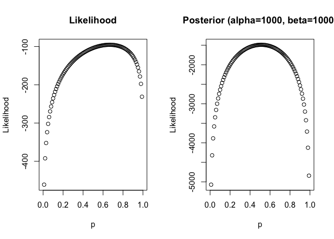

Parameter Estimation and Machine Learning
================
Yue Shi, Ph.D candidate, University of Washington
5/8/2018

-   [Maximum Likelihood Estimation (MLE)](#maximum-likelihood-estimation-mle)
    -   [Example: Halitosis example](#example-halitosis-example)
-   [Maximum a Posteriori (MAP) Estimation](#maximum-a-posteriori-map-estimation)
    -   [beta distribution](#beta-distribution)
    -   [Example:Thumbtack example (unfair coin)](#examplethumbtack-example-unfair-coin)

Maximum Likelihood Estimation (MLE)
-----------------------------------

Likelihood is:
*L*(*θ* : *D**a**t**a*)=*P*(*D**a**t**a*|*θ*)
 Maximum likelihood Estimation is to find *θ*<sup>\*</sup> to maximize the likelihood. This *θ*<sup>\*</sup> is the maximum likelihood estimate of *θ*.

#### Example: Halitosis example

Halitosis, colloquially called bad breath, is a symptom in which a noticeably unpleasant odor is present on the exhaled breath. Halitosis is partly genetically determined. The genotype aa has a 40% chance of getting the disease, and the other two possible genotypes, AA and Aa, each has a 10% chance of getting the disease. We want to estimate the frequency of the A allele.

If the gene frequency of the A allele is p, and that of a is 1-p, then the frequency of the disease is expected to be (if the genotypes are in Hardy-Weinberg proportions as a result of random mating):

*F* = *p*<sup>2</sup> × (0.1)+2*p*(1 − *p*)×(0.1)+(1 − *p*)<sup>2</sup> × (0.4)

Now suppose we observe 1000 individuals and find that the 182 of them have the disease. Using a binomial distribution, the probability that 182 out of 1000 have the disease is the binomial class probability for 182 out of 1000 when the probability of the event is F (which is a function of p). This is

$$\\frac{1000!}{182!~818!} F^{182} (1-F)^{818}$$

``` r
##Given p, calcualte the probability of getting Halitosis
H=function(x){
  hal=0.1*x^2 + 0.1*2*x*(1-x) + 0.4*(1-x)^2 
  return(hal)
}

##Given H, calcualte the log likelihood of getting the data. 
LD=function(x){
  LL=182*log(x)+818*log(1-x)
  return(LL)
}

##Now let's find p which maximize the LD. 
fp=seq(0,1,0.001)
fLD=LD(H(fp))
mle=fp[which.max(fLD)]
mle
```

    ## [1] 0.477

``` r
plot(fLD~fp, xlab="Allele frequency of A", ylab="Data Likelihood")
grid(10,10)
abline(v=mle,col="red")
```


Maximum a Posteriori (MAP) Estimation
-------------------------------------

Posterior probability is:
$$
P(\\theta | D) = \\frac{P(D|\\theta)P(\\theta)}{P(D)} = \\frac{P(D|\\theta)P(\\theta)}{\\int P(D|\\theta)P(\\theta)d\\theta}
$$
 Since the demoninator is not a function of *θ*, therefore we can ignore the denominator， then
$$
\\begin{eqnarray}
P(\\theta | D) &\\propto& P(D|\\theta)P(\\theta)\\\\
Posterior &\\propto& Likelihood \* Prior
\\end{eqnarray}
$$
 MAP estimation is to find *θ* that maximizes posterior *P*(*θ*|*D*).
The difference between MLE and MAP is that:
For MLE: find *θ* that maximizes *l**o**g**P*(*D*|*θ*); whereas
For MAP: find *θ* that maximizes *l**o**g**P*(*D*|*θ*)+*l**o**g**P*(*θ*).

The difference between MAP and Bayesian estimation is that:
MAP ignore the demoninator which integrate all of the possible *θ*, which makes Bayesian method much more computational demanding. MAP is must faster and popular now.

#### beta distribution

**beta distribution**is parameterized by two shape constraints *α* and *β*. It does the job nicely for expressing the prior belief of probability which is restricted in the range \[0,1\].

$$
P(p)=\\frac{1}{B(\\alpha,\\beta)}p^{\\alpha-1}(1-p)^{\\beta-1}
$$
 where $B(,) is the beta function.

When both *α* and *β* are greater than zero, it has the following properties:
$$
mode=\\frac{\\alpha-1}{\\alpha+\\beta-2}
$$
$$
variance=\\frac{\\alpha\\beta}{(\\alpha+\\beta)^2(\\alpha+\\beta+1)}
$$

#### Example:Thumbtack example (unfair coin)

``` r
nh <- 100 #the number of heads
nt <- 50 #the number of tails
alpha <- 1000 #alpha and beta are hyperparameters
beta <- 1000
logLikelihood <- function(p, nh, nt){
  return(nh*log(p)+nt*log(1-p))
}

logPosterior <- function(p, nh, nt, alpha, beta){
  return((nh+alpha-1)*log(p)+(nt+beta-1)*log(1-p))
}
p=seq(0,1,0.01)
LL=logLikelihood(p,nh,nt)
LP=logPosterior(p,nh,nt,alpha,beta)
par(mfrow=c(1,2))
plot(LL~p, ylab="Likelihood",main="Likelihood")
plot(LP~p, ylab="Likelihood",main="Posterior (alpha=1000, beta=1000)")
```



``` r
LL.max=p[which.max(LL)]
LL.max
```

    ## [1] 0.67

``` r
nh/(nh+nt)
```

    ## [1] 0.6666667

``` r
LP.max=p[which.max(LP)]
LP.max
```

    ## [1] 0.51

``` r
(nh+alpha-1)/(nh+nt+alpha+beta-1)
```

    ## [1] 0.5114007

Let's minimize the influence of priors

``` r
alpha=30
beta=30
LL=logLikelihood(p,nh,nt)
LP=logPosterior(p,nh,nt,alpha,beta)
par(mfrow=c(1,2))
plot(LL~p, ylab="Likelihood",main="Likelihood")
plot(LP~p, ylab="Likelihood",main="Posterior (alpha=30, beta=30)")
```


``` r
LL.max=p[which.max(LL)]
LL.max
```

    ## [1] 0.67

``` r
nh/(nh+nt)
```

    ## [1] 0.6666667

``` r
LP.max=p[which.max(LP)]
LP.max
```

    ## [1] 0.62

``` r
(nh+alpha-1)/(nh+nt+alpha+beta-1)
```

    ## [1] 0.6172249
